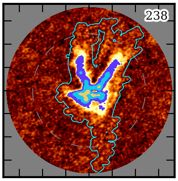
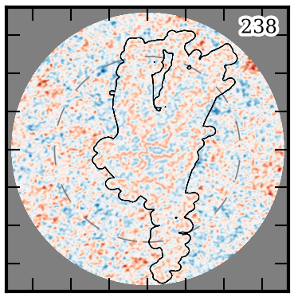
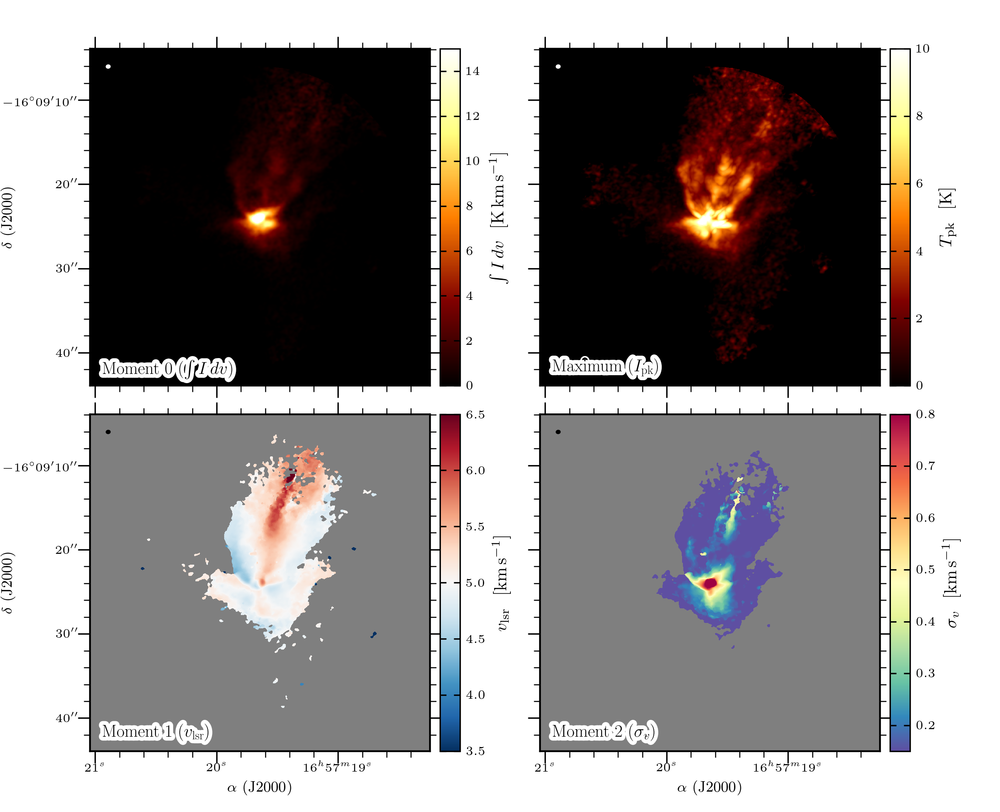
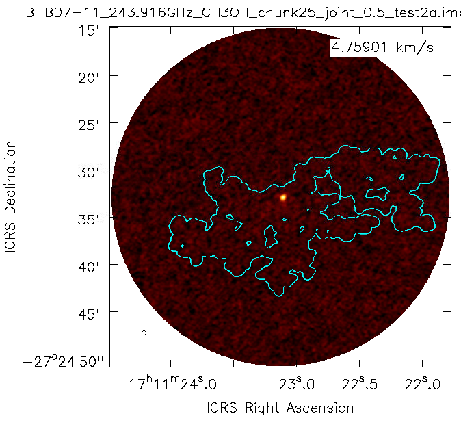

User Guide
==========
Welcome to the pipeline User Guide! This guide details how to (1) run the
pipeline interactively for combinations of targets and spectral windows, (2)
how to trouble-shoot the pipeline products and results, and (3) run batch
scripts for parallel processing. A table of contents tree may be found in the
left side-bar.

Note on system resources
------------------------
Imaging the full bandwidth cubes can require a large volume of disk space to
store all of the intermediate image products.  For example, the products can be
greater than 100GB for a single SPW and several TB for a full Setup.  After
producing the final cubes, the intermediate products may be removed.  Please
ensure that the host system has sufficient resources to run the pipeline. If
the host system has limited storage, we recommend imaging one spectral window
(SPW) at a time and removing the intermediate products after it has finished.

Importing the pipeline
----------------------
If you have not already done so, please see the :doc:`Installation
<environment>` page for instructions on how to download and load the script in
CASA. Please ensure that the paths are configured correctly: that ``DATA_DIR``
points to the directory containing the measurement sets and that CASA is
started from the directory set in ``PROD_DIR``). Next, start CASA interactively
from a shell prompt and execute the pipeline script using ``execfile`` (see the
:doc:`Installation <environment>` page). To start an interactive session with
an example products directory of ``PROD_DIR="/mnt/scratch/faust"`` and a
pipeline script located at
``/mnt/scratch/faust/faust_line_imaging/faust_imaging.py``, run:

.. code-block:: bash

   $ cd /mnt/scratch/faust  # for example
   $ casa

and then from the interactive CASA prompt:

.. code-block:: python

   CASA <1>: execfile('faust_line_imaging/faust_imaging.py')

Names and labels
----------------
Targets are referred to by their field names, e.g. "CB68" or "BHB07-11", as
they appear in the measurement sets. All valid field names can be read from
the global variable ``ALL_FIELD_NAMES``:

.. code-block:: python

   print(ALL_FIELD_NAMES)

SPWs are assigned unique labels based on the principle molecular tracer
targeted in the window. These labels are prefixed by the rest frequency of the
transition (truncated to the nearest MHz) and followed by the simple formula
name for the molecule. The CS (5-4) transition in Setup 2, for example, has the
label "244.936GHz_CS". All valid SPW labels can be read from the global
variable ``ALL_SPW_LABELS``:

.. code-block:: python

   print(ALL_SPW_LABELS)

To image narrow-bandwidth "cut-outs" around lines without imaging the full
bandpass of a SPW, see the Cookbook section :any:`Imaging cut-out velocity
windows`.

Running the pipeline
--------------------
The primary user interface for running the pipeline tasks is through the Python
class :class:`faust_imaging.ImageConfig`, specifically the constructor
:meth:`faust_imaging.ImageConfig.from_name`. The preceding links point to
the API documentation that further describe the calling convention and
arguements functions and classes take. Most of this information can also be
found in the docstrings as well, which can be read by running ``help <ITEM>``
or ``<ITEM>?`` from the CASA prompt. The :any:`Pipeline Tasks` section of the
Cookbook describes the individual processing steps of the pipeline in detail.

Once an instance of ``ImageConfig`` is created and set with the desired
options, the pipeline can be be run using the
:meth:`faust_imaging.ImageConfig.run_pipeline` bound method. To run the
pipeline for "CB68" and the SPW containing CS (5-4) in Setup 2 with the
default pipeline parameters, run:

.. code-block:: python

   config = ImageConfig.from_name('CB68', '244.936GHz_CS')
   config.run_pipeline(ext='clean')
   # The final products will be given a suffix based on `ext` above,
   # the default is "clean". Different names may be used to avoid over-
   # writing existing files.

The default parameters will use a Briggs robust *uv*-weighting of 0.5 and
jointly deconvolve all array configurations (12m & 7m). We recommend imaging
one "line of interest" first to test that the pipeline works and produces
sensible results before moving to batched processing. The final pipeline
products will have a suffix "_clean" before the CASA image extension (e.g.,
".image" or ".mask"). In the above example, the final primary beam corrected
image will be written to:

.. code-block:: bash

   # Path relative to where CASA is run (also the value of `PROD_DIR`)
   images/CB68/CB68_244.936GHz_CS_joint_0.5_clean.image.pbcor.common.fits

   # Files are named according to the convention:
   #   <FIELD>_<SPW_LABEL>_<ARRAY>_<WEIGHTING>_<SUFFIX>.<EXT>
   # where
   #   FIELD     : source/field name
   #   SPW_LABEL : rest-frequency and molecular tracer based name
   #   ARRAY     : array configurations used; can be 'joint', '12m', '7m'
   #   WEIGHTING : uv-weighting applied, e.g. 'natural' for natural weighting
   #               or '0.5' Briggs robust of 0.5.
   #   SUFFIX    : name to distinguish different files, 'clean' is used for
   #               the default final pipeline products. Intermediate products
   #               will also exist with suffixes including 'dirty', 'nomask',
   #               etc.
   #   EXT       : CASA image extension name, e.g. '.image' or '.mask'

   # Other non-standard image extensions produced will include '.common' for
   # images that have been smoothed to a common beam resolution, '.hanning' for
   # hanning smoothed images, and '.pbcor' for images corrected for attenuation
   # by the primary beam.

Please see the :doc:`API documentation <faust_imaging>` or docstring for
further configuration information. For examples of more advanced uses
of the pipeline please refer to the :doc:`Cookbook <recipes>`.

Quality assurance plots and moment maps
---------------------------------------
After the pipeline has been run, the next step is to validate the results.
This is done by creating quality assurance plots for visual inspection and
moment maps. The QA plots generate channel maps of the restored image and
residual with the clean-mask overplotted. Only channels containing significant
emission are plotted (regardless of whether the emission is masked). The
default threshold to show such channels is 6-times the full-cube RMS.  To
create the quality assurance plots call the function
:func:`faust_imaging.make_all_qa_plots` for the desired field and extension
(e.g., "clean" as used above).

.. code-block:: python

   make_all_qa_plots('CB68', ext='clean', overwrite=False)

The ``overwrite=False`` keyword argument ensures that QA plots are only
generated for images that do not already exist, so this function can be safely
called after new pipeline jobs have been run. Plots will be written to
``plots/`` or the value of ``PLOT_DIR``. Note that the creation of the plots is
implemented inefficiently with ``matplotlib`` and ``imshow``, and thus creating
the plots for the Setup 3 SPWs may require >50 GB of memory.

The above figures show channel index number 238 of CB68 CS (5-4) for the
restored image (**left**) and the residual image (**right**). For the restored
image, color-scale ranges from -3 to 10 times the full-cube RMS and the filled
contours are shown at increments of 10, 20, 40, and 80 times the RMS.  The cyan
contour shows the clean mask. For the residual image the color scale ranges
from -5 to 5 times the RMS (negatives shown in blue) and the black contour
shows the clean mask. The tick-marks show increments of 5 arcsec, the dashed
line shows the half-power beamwidth of the primary beam, and imaged out to the
20%-power point of the primary beam.

Further details on the QA plots may be found in the Cookbook section
:any:`QA Plots`.

Moment maps may be generated by running the :func:`make_all_moment_maps`
function for the desired field and extension (e.g., "clean" as used above).

.. code-block:: python

   make_all_moment_maps('CB68', ext='clean')

Maps based on the integrated intensity ("mom0"), maximum or peak intensity
("max"), centroid velocity ("mom1"), and velocity dispersion ("mom2") will be
written to the ``moments/`` directory or the value of ``MOMA_DIR``. The images
can be inspected with your FITS viewer of choice. The figure below shows an
example matplotlib visualization of the moments for CB68 CS (5-4).

The above figures can be generated using the ``util/moment_plotting.py`` script
under Python **v3** (currently undocumented; requires packages numpy, scipy,
skimage, matplotlib, aplpy, radio_beam, and astropy).

Trouble-shooting
----------------
With the deconvolved image products and the quality assurance plots made, the
next step is to inspect the results and resolve whether they are satisfactory
for the science-goals of the Source Team. The following sub-sections describe
common scenarios where the results are problematic and steps that may be taken
to improve the imaging.

Extended negative emission
~~~~~~~~~~~~~~~~~~~~~~~~~~
*Are any strong negative-intensity artifacts or "bowls" masked?*
Extended emission that is not properly recovered due to missing short-spacings
can introduce negative bowls that should not be cleaned and added to the source
model.  If this is observed, the auto-masking parameters may be tuned to limit
the masking of negative emission.

.. code-block:: python

   config = ImageConfig.from_name('CB68', '244.936GHz_CS')
   config.autom_kwargs['negativethreshold'] = 8  # the default is 7
   config.run_pipeline()

True absorption does frequently occur, however, towards the bright and compact
continuum emission the central protostellar source(s). Because the visibility
data is continuum subtracted, this absorption will appear negative in the
restored images.  This absorption should be masked and cleaned.

Overly permissive clean masks
~~~~~~~~~~~~~~~~~~~~~~~~~~~~~
*Does the generated clean-mask appear to be overly permissive and include large
areas without apparent emission?*  This effect has been known to appear in
earlier iterations of the pipeline for certain fields with many execution
blocks.  The pipeline uses the `auto-multithresh
<https://casaguides.nrao.edu/index.php/Automasking_Guide>`_ algorithm in
``tclean`` to procedurally generate the clean masks with an initial mask
generated from a partially deconvolved version of the image.  If the parameters
of the auto-multithresh algorithm (`Kepley et al. (2020)
<https://iopscience.iop.org/article/10.1088/1538-3873/ab5e14>`_) are improperly
tuned, the mask can undergo something similar to runaway growth yielding
an "amoeba" like appearance, as can be seen in the following figure:

   The mask includes a large fraction of the field without apparent emission.

In some circumstances, all pixels in a channel may even be included in the
mask.  Note that such cases will appear to have no mask when using the
``casaviewer`` to plot a contour-diagram.  This effect seems to be largely
mitigated with the latest set of default parameters, but careful attention
should be paid in case it appears.  Spurious masking will have adverse effects
on both the image quality and the moment maps. Over-cleaning within such a mask
may corrupt the noise statistics and include artifacts in the source model. The
clean mask is also used for selecting pixels to use in creating the moment
maps, and can produce poor results when large areas of effectively just noise
are included.

The most straightforward solution is to raise the significance threshold used
to "grow" the mask.

.. code-block:: python

   config = ImageConfig.from_name('CB68', '244.936GHz_CS')
   config.autom_kwargs['lownoisethreshold'] = 2.0  # the default is 1.5
   config.run_pipeline()

Significant uncleaned emission
~~~~~~~~~~~~~~~~~~~~~~~~~~~~~~
*Has the automated masking left significant levels of emission unmasked, and
thus uncleaned?* This can frequently be diagnosed in the QA plots of the
residual image. The investigator may use their discretion to decide whether
such emission produces adverse affects and should be cleaned.  Multiple methods
exist to fix such images without re-running the full pipeline over again.  The
final clean may be restarted with:

   #. auto-multithresh but with a lower 'lownoisethreshold'
   #. auto-multithresh and manually adding regions to the existing mask
   #. without using auto-multithresh and manually adding regions to the
      existing mask
   #. an initial mask including fainter and more extended emission

The following example describes methods 1-3.  The pipeline processes discrete
image "chunks" in frequency to improve performance and ease memory constraints.
Restarting thus requires operating on the chunk containing the offending
emission.  More information on manually restarting one chunk is described in
the Cookbook :any:`Restarting one chunk` section.  In the following example,
channel index number 238 is insufficiently cleaned and the offending chunk is
restarted with the interactive cleaning.

.. code-block:: python

   # The standard, full instance will apply operations to the entire SPW,
   # even if "under the hood" the processes are being applied to each
   # sub-image or "chunk".
   full_config = ImageConfig.from_name('CB68', '244.936GHz_CS')

   # To get the frequency chunk with issues, we manually retrieve the
   # `ImageConfig` instances for every chunk.
   chunked_configs = full_config.duplicate_into_chunks()
   problematic_config = chunked_configs.get_chunk_from_channel(238)

   # (Method 1) Restart tclean non-interactively with a lower
   # `lowernoisethreshold` for auto-multithresh.
   #problematic_config.autom_kwargs['lownoisethreshold'] = 1.0
   #problematic_config.clean_line(ext='clean')

   # (Method 2) Restart tclean interactively using the existing clean mask and model.
   problematic_config.clean_line(ext='clean', restart=True, interactive=True)
   # ^ The casaviewer will appear for manual masking. Identify the channel
   #   with the offending emission (the channel indices will now be of the chunk)
   #   and draw an addition to the mask. Often times it suffices to select
   #   the "blue rightward arrow" icon immediately if the emission is faint.

   # (Method 3) Restart tclean interactively without auto-multithresh, using
   # a static mask that we can add to.
   #problematic_config.clean_line(ext='clean', mask_method='fixed',
   #            restart=True, interactive=True)

   # Postprocess the results to reproduce the final full-cube products
   chunked_configs.postprocess(ext='clean')

Alternatively, the procedure used to generate the initial "seed" mask can be
modified in order to include larger scales or lower-significance emission
(method 4). The final clean run without manual intervention. Following the same
conventions as in the previous example:

.. code-block:: python

   full_config = ImageConfig.from_name('CB68', '244.936GHz_CS')
   chunked_configs = full_config.duplicate_into_chunks()
   problematic_config = chunked_configs.get_chunk_from_channel(238)

   # Add a fourth scale to the seed mask generation using a Gaussian
   # kernel with a FWHM of 5 arcsec. The default scales are 0 (unsmoothed),
   # 1, and 3 arcsec.
   problematic_config.mask_ang_scales = [0, 1, 3, 5]  # arcsec

   # The default significance threshold applied to each scale is 5 sigma,
   # here we use 4 sigma.
   problematic_config.make_seed_mask(sigma=4.0)
   # Re-run the deconvolution using the new seed mask.
   problematic_config.clean_line(ext='clean')

   chunked_configs.postprocess(ext='clean')

Inconsistent masking from varying noise
~~~~~~~~~~~~~~~~~~~~~~~~~~~~~~~~~~~~~~~
*Are an unusual number of noise spikes masked at the band edges?*
The sensitivity as a function of frequency for some SPWs is affected by
atmospheric lines. Examples include the "231.221_13CS" and "231.322_N2Dp" SPWs
in Setup 1. An atmospheric ozone feature between these two windows increases
the RMS by about 20% towards the respective band edge.  In some circumstances,
the use of a single RMS can lead to over-masking of many small noise spikes
near the band edge. If this is the case, then using smaller image-chunk sizes
should give more uniform results.

Divergences or negative edge-features
~~~~~~~~~~~~~~~~~~~~~~~~~~~~~~~~~~~~~
*Do very strong, negative features appear at the edge of the mask or field?*
It is a known issue that the multiscale clean implementation in CASA can
be unstable when also using clean masks. In some circumstances ``tclean`` can
diverge at the edge of the clean mask or primary beam mask and insert spurious
positive-intensity features into the model. These features are usually on large
scales (often similar to the ACA synthesized beam) and produce strong
negative-intensity features in the restored image.

The default parameters have been found to largely stabilize ``tclean`` by
slowing the rate of convergence in the minor cycle. If these divergences
appear, try running the pipeline with a lower ``gain`` and higher
``cyclefactor``:

.. code-block:: python

   config = ImageConfig.from_name('CB68', '244.936GHz_CS')
   config.gain = 0.03  # default 0.05
   config.cyclefactor = 2.5  # default 2.0
   config.run_pipeline()

The above changes to the loop gain and cyclefactor may make ``tclean``
run much more slowly however. Alternative solutions are to reduce the
size of the largest scale used by multiscale-clean or omit the largest
scale altogether:

.. code-block:: python

   config = ImageConfig.from_name('CB68', '244.936GHz_CS')
   config.scales = [0, 15, 45]  # pix; default [0, 15, 45, 135]
   # the cell size in arcsec can be read from `config.dset.cell`
   config.run_pipeline()

Running the parallel pipeline
-----------------------------
To run the pipeline in parallel, please refer to the :any:`Parallel CASA`
section in the Cookbook. Example scripts are included for imaging a single
SPW in parallel and also imaging all of the SPWs for a setup in parallel.
On the NRAO NM postprocessing cluster, typical run-times are a few hours
when imaging a single SPW in parallel and a few days for imaging all SPWs
of a setup.

